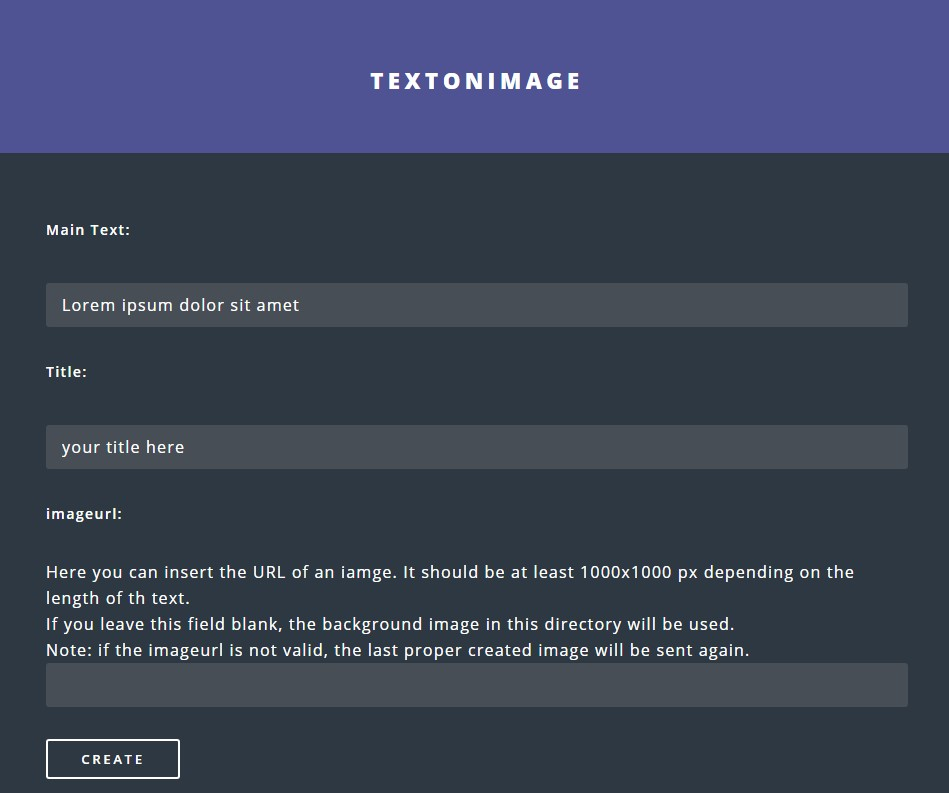

# TextonImage 
Write a main text, a title and your watermark on ether a specific image file in your directory or insert an image url

## Examplefootage

## Goal
Create nice looking images for a social media account (e.g. instagram).
No need to photoshop these images manually.

Depending on the length of the text, the font size will be adapted within certain limits.

## Implementation
HTML form with textfields for the main text, title and (optionally) the imageurl.

The image will be sent to you by a telegram bot (create a telegram bot, create a group chat with yourself and your bot, insert the bottoken and chatid in the index.php file line 139).

You can select your ttf font file in line 81.

## Workflow
When I want to upload a new instagram image, I create the image using my script. The image will be sent to me via Telegram. By using the telegram app I can download the image to my phone. From there it's easy to upload it to instagram. 
